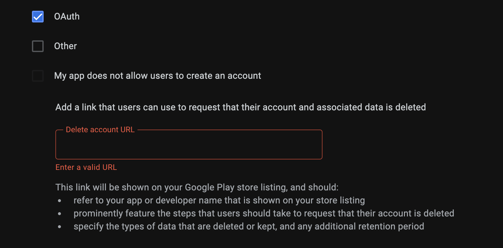

# Android Data Safety Template

If you're an Android developer, you're likely aware of the new Data Safety standards that the Google Play Store is now requiring. In the past, this involved including a mechanism in your app to let the user delete their account under some circumstances. Now, the requirements have increased, and users must be able to delete their account from **outside of the app** via a web interface.

This can seem like a daunting task if you never intended to have a website for your app.

The bottom-line is, I get it. I've had to do the same thing too for my own published apps, and I want to help save you some time and frustration.

This repository contains a template for a simple web interface that you can use to meet the new Data Safety requirements. I made this for my own apps and they've been approved and work great. I'll work you through the setup, and if you've never touched web development before, don't worry. This should only take about 10-20 minutes of time. I'll explain everything you need to know.

## Features

- **NextJS + React**: NextJS is a framework for React that makes static site and server-side rendering easy. It's a great choice for this kind of project because we also need to send emails which requires a node server
- **Sends a support Email**: This repo includes an endpoint that the web form invokes in order to send a support email to yourself
- **Single Page**: There's just one page, and it has placeholders for logos + app screenshots to cover all the bases

## Setup

- **Clone this repository**: `git clone https://github.com/DaveAldon/Android-Data-Safety-Template.git`
- **Install NodeJS**: If you don't have NodeJS installed, you can download it [here](https://nodejs.org/en/download/)
- **Go into the new repo folder and install the dependencies**: `npm i`
- **Create a Zoho Mail account**: This project uses `NodeMailer` which is easiest to use with an email account that supports basic username/password authentication. Gmail doesn't fit this because it's not designed to be automated. This project uses Zoho for ease of use, something I use as well. You'll need to create a Zoho Mail account in order to send the support emails. It's all free and should only take about 5 minutes. Follow their guide here: [Making a Zoho Email address](https://www.zoho.com/mail/how-to/create-an-email-account.html)
- **Put the Zoho email credentials into the `.env` file**: You'll see a `.env.example` file in the root of the project. Copy it and rename it to `.env`. Then, fill in the `EMAIL_USERNAME` and `EMAIL_PASSWORD` fields with your Zoho email address and password. This is the email that the support form will send to.
- **Run the project locally**: `npm run dev`
- **Open the project in your browser**: Go to `http://localhost:3000` and you should see the web form.

- **Test the support form**: Fill out the form and click "Submit". You should receive an email at the address you specified in the `.env` file. If there are errors, check the console

## Deploying

NextJS is a static site generator, so you can deploy this to any static site host. I recommend Vercel because it's FREE and it's made by the same people who made NextJS. Here's how to do it:

- **Make a Vercel account**: Go to [Vercel.com](https://vercel.com) and sign up for an account
- **Build the project**: Run `npm run build` to verify that the project builds correctly
- **Make sure your cloned repo is on GitHub**: If it's not, you can create a new repository and push your project to it
- **Link the repo to your Vercel account**: Go to the Vercel dashboard and click "Add New Project". Then, select your repo as the source and leave the defaults in the forms
- **Add your environment variables to Vercel**: There's a setting on the new project page to add the values from your `.env` file. Make sure to match these values and click "Deploy". You'll get a public *https* link to your new site if everything builds correctly

- **Update your app's Data Security policy in the Google Play Store**: Go to your app's listing in the Google Play Console and update the Data Security policy to include the new web link you got from Vercel. It should go here:

- **Submit your changes**: Once the web form works and the link is in place for your Google Play store listing, you can submit your changes. It should be approved within a few days.

## Considerations

- **Customization**: This is a very basic web form. You **NEED** to customize it to match your app's branding. Swap out the `<App Name>` strings with your app's name, and the placeholder images with your app's logo and a screenshot of where the user could delete their account in the app if they want. I do this to try and cover any scenarios that the Google Play Store might be looking for.
- **Automation**: This template doesn't have any special logic going on. If you use this project and don't change any of the processes, you need to be able to manually handle the support emails that come in requesting account deletion. If your app has a backend that you can control, the next step could theoretically be:
  - Allow the user to submit their email to request account deletion
  - Send a confirmation email to the user that includes a federated magic link to delete their account
  - When the user clicks the link, an account deletion measure is triggered in your app's backend

Once again, this template serves to be the bare minimum to meet the new Data Safety requirements. It's not a complete solution, but it's a great starting point to get your requirements met quickly so that you can have some breathing room to work on a more complete solution.
